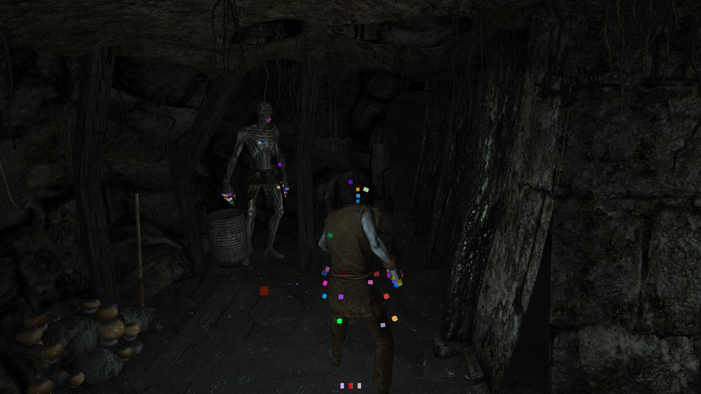

# Skyrim Engine

A mod and renderer for skyrim, it uses the three.js scene graph and shaders.

It has an engine / app separation. Use the source freely in your endeavors. See the branches for legendary-edition.

Miryks is all about data. It uses C for this ([[source]](/miryks/src/lib), [[headers]](/miryks/include/lib)). The opengl code sits here: ([[source]](miryks/src/opengl), [[headers]](miryks/include/opengl)). The main engine include can be found [here](miryks/include/miryks/miryks.hpp).
## Libs used
libpng 1.6.35
zlib 1.2.11
lz4 1.9.3
glm 0.9.9.8
glfw 3.3.4
imgui 1.83
bullet3 3.17

This project would have never worked without nifskope, its helpful hex offsets, and its source code here on github.
